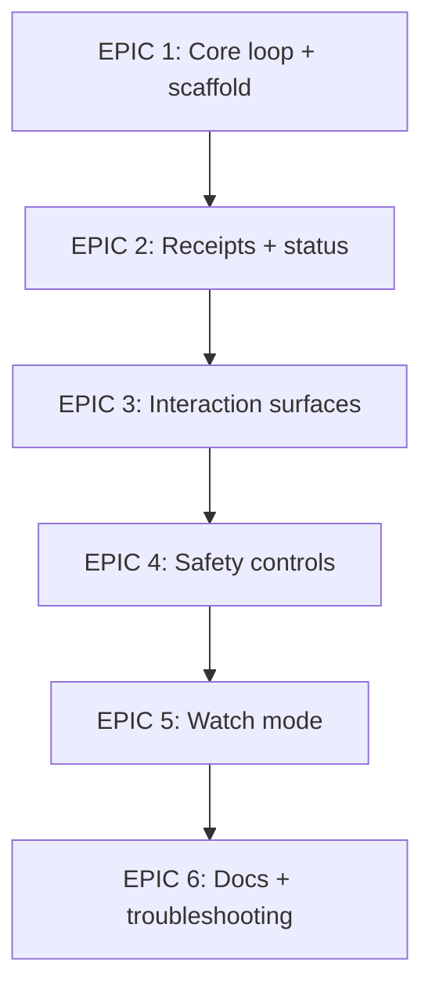

# Build Plan

> Use for `.spec/build-plan-2026-01-23-ralph-gold-prd.md`.  
> Every paragraph ends with `Evidence:` or `Evidence gap:`.

## 0) Build Plan Summary

Deliver a deterministic, auditable CLI loop for agent execution with clear interaction surfaces, safety controls, and measurable exit conditions.  
Evidence: README.md; docs/GOLDEN_LOOP.md.

## 1) Outcome → Opportunities → Solution

- Outcome: predictable, repeatable agent loop execution with durable state and audit artifacts.  
- Opportunities: reduce agent drift, enforce gates/review, and improve visibility via status/TUI/watch.  
- Chosen solution: CLI-first loop with `.ralph/` artifacts, receipts/context snapshots, configurable gates and review token, optional TUI and watch mode.  
- Rejected alternatives: single long-running agent process without resets; hosted SaaS runner for loops.  
Evidence: README.md (fresh context per iteration, receipts, review gate, TUI, watch mode); docs/GOLDEN_LOOP.md; user interview 2026-01-23 (tradeoff decision).

## 2) Key Assumptions & Risks (Top 3–5)

- Assumption/Risk: users will accept CLI-first workflows for loop control.  
  Mitigation: TUI and interactive selection as optional UX layers.  
  Evidence: README.md (TUI, interactive mode).

- Assumption/Risk: large artifact growth can slow runs or fill disks.  
  Mitigation: cleanup guidance and configurable retention.  
  Evidence: docs/PROJECT_STRUCTURE.md; docs/NEW_FEATURES.md.

- Assumption/Risk: watch mode auto-commit may capture unintended changes.  
  Mitigation: explicit enablement and warnings in docs.  
  Evidence: README.md (auto-commit risk note).

- Assumption/Risk: unauthorized file writes could impact sensitive paths.  
  Mitigation: authorization rules with scoped permissions.  
  Evidence: docs/AUTHORIZATION.md.

- Assumption/Risk: sensitive data may appear in `.ralph/` logs or receipts.  
  Mitigation: treat `.ralph/*` logs as sensitive and avoid secrets in prompts/logs.  
  Evidence: AGENTS.md (Security & Configuration Tips).

## 3) Epics (Sequenced)

1) Epic: Core loop + scaffolding (`ralph init`, `run`, `step`, `.ralph/` layout).  
2) Epic: Evidence artifacts (receipts, context snapshots, logs) + status reporting.  
3) Epic: Interaction surfaces (interactive selector, TUI).  
4) Epic: Safety controls (review gate, authorization rules).  
5) Epic: Watch mode + developer feedback loops.  
6) Epic: Documentation + troubleshooting updates.  
Evidence: README.md; docs/PROJECT_STRUCTURE.md; docs/COMMANDS.md; docs/EVIDENCE.md; docs/TROUBLESHOOTING.md.

## 4) Stories per Epic (with Acceptance Criteria)

### Epic: Core loop + scaffolding

- Story: Initialize `.ralph/` scaffold with required files.  
  Acceptance Criteria: `ralph init` creates config, PRD tracker, prompts, and logs directories.  
  Validation: pytest (if scaffold functions are unit-tested) + manual CLI smoke check.  
  Evidence: README.md; docs/PROJECT_STRUCTURE.md; AGENTS.md.

- Story: Run a bounded loop with `--max-iterations`.  
  Acceptance Criteria: `ralph run --max-iterations N` stops after N iterations and returns correct exit code.  
  Validation: pytest + manual CLI smoke check.  
  Evidence: README.md; docs/COMMANDS.md; docs/TROUBLESHOOTING.md.

### Epic: Evidence artifacts + status

- Story: Generate receipts and context snapshots per iteration.  
  Acceptance Criteria: receipts and ANCHOR context exist for each iteration.  
  Validation: pytest + manual inspection of `.ralph/receipts/` and `.ralph/context/`.  
  Evidence: docs/PROJECT_STRUCTURE.md; docs/EVIDENCE.md.

- Story: Report status and progress.  
  Acceptance Criteria: `ralph status` returns current task and iteration info; detailed/graph outputs are available.  
  Validation: pytest + manual CLI check.  
  Evidence: README.md; docs/COMMANDS.md; docs/PROGRESS.md.

### Epic: Interaction surfaces

- Story: Interactive task selection for `step` and `run`.  
  Acceptance Criteria: user can select tasks from an interactive list and selection maps to task choice.  
  Validation: pytest (selector logic) + manual CLI.  
  Evidence: README.md; docs/interactive_selection.md.

- Story: TUI control surface.  
  Acceptance Criteria: TUI starts and keybindings (s/r/a/p/q) operate as documented.  
  Validation: manual check.  
  Evidence: README.md; docs/COMMANDS.md.

### Epic: Safety controls

- Story: Review gate requires configured token.  
  Acceptance Criteria: loop does not exit until `review.required_token` is observed when enabled.  
  Validation: pytest + manual CLI.  
  Evidence: README.md; docs/CONFIGURATION.md.

- Story: Authorization rules restrict write paths.  
  Acceptance Criteria: writes outside allowed paths are blocked or rejected.  
  Validation: pytest + manual CLI.  
  Evidence: docs/AUTHORIZATION.md.

### Epic: Watch mode + feedback loops

- Story: Watch mode triggers gates on file changes.  
  Acceptance Criteria: `ralph watch` runs configured gates and respects debounce/patterns.  
  Validation: manual CLI.  
  Evidence: README.md; docs/CONFIGURATION.md.

- Story: Auto-commit is opt-in.  
  Acceptance Criteria: auto-commit only runs when explicitly enabled.  
  Validation: manual CLI.  
  Evidence: README.md.

### Epic: Documentation + troubleshooting

- Story: Keep docs aligned with CLI behaviors.  
  Acceptance Criteria: README and command docs reflect current CLI surface and defaults.  
  Validation: doc review.  
  Evidence: README.md; docs/COMMANDS.md; docs/TROUBLESHOOTING.md.

### Test Mapping (story → test)

| Story | Test Type | Command |
| --- | --- | --- |
| init scaffold | unit/integration | `uv run pytest -q` |
| run/step loop | integration | `uv run pytest -q` |
| receipts/context | integration | `uv run pytest -q` |
| status output | integration | `uv run pytest -q` |
| interactive selection | unit | `uv run pytest -q` |
| review gate | unit/integration | `uv run pytest -q` |
| authorization rules | unit/integration | `uv run pytest -q` |
| watch mode | manual | `ralph watch` |
| TUI | manual | `ralph tui` |
Evidence: AGENTS.md (pytest command), README.md (CLI commands).  
Evidence: user interview 2026-01-23 (test mapping decision).

## 5) Data + Contracts (Lightweight)

- Entities: ralph.toml config, PRD tracker, state.json, receipts JSON, context snapshots, logs.  
- Key fields (minimum required):
  - state.json: iteration_id, task_id, status, exit_code, started_at, finished_at.  
  - receipts: attempt_id, command, status, timestamp, citations.  
  - context: iteration_id, ANCHOR.md content reference.  
- Constraints/indexes: required fields above; no indexes (file-based JSON artifacts).  
- API/routes: VS Code bridge status/step endpoints (optional integration).  
- Permissions/auth: authorization rules to constrain write paths.  
Evidence: docs/PROJECT_STRUCTURE.md; docs/EVIDENCE.md; docs/VSCODE_BRIDGE_PROTOCOL.md; docs/AUTHORIZATION.md.  
Evidence: user interview 2026-01-23 (schema requirement decision).

Minimum schema (required fields):  
| Artifact | Field | Type | Required |  
| --- | --- | --- | --- |  
| state.json | iteration_id | string | yes |  
| state.json | task_id | string | yes |  
| state.json | status | string | yes |  
| state.json | exit_code | int | yes |  
| state.json | started_at | string (ISO-8601) | yes |  
| state.json | finished_at | string (ISO-8601) | yes |  
| receipts | attempt_id | string | yes |  
| receipts | command | string | yes |  
| receipts | status | string | yes |  
| receipts | timestamp | string (ISO-8601) | yes |  
| receipts | citations | array | yes |  
| context | iteration_id | string | yes |  
| context | anchor_path | string | yes |  
Evidence: docs/PROJECT_STRUCTURE.md; docs/EVIDENCE.md.  
Evidence: user interview 2026-01-23 (schema decision).

## 6) Security & Privacy Requirements

- AuthN/AuthZ: local CLI runs as the current OS user; authorization rules enforce path-based write permissions.  
- Input validation/abuse cases: reject invalid config values and path traversal attempts in write targets.  
- Secrets handling: avoid secrets in prompts/logs; treat `.ralph/*` as sensitive.  
- Data classification: `.ralph/` logs, receipts, and context are sensitive; config files are non-sensitive but should avoid secrets.  
- Retention: default cleanup guidance is logs > 30 days, receipts > 60 days, context > 60 days.  
Evidence: docs/AUTHORIZATION.md; AGENTS.md (sensitive logs); docs/NEW_FEATURES.md (cleanup defaults).  
Evidence: user interview 2026-01-23 (policy decision); input validation requirement accepted for v1.

## 7) Test Strategy

- Unit tests: core loop logic, config parsing, receipt writing.  
- Integration tests: run/step iteration flow and status output.  
- E2E tests: CLI smoke checks (`ralph --help`, `ralph init`, `ralph step`).  
- Failure-mode tests: gate failure, invalid loop mode, watch disabled.  
Evidence: AGENTS.md (pytest), docs/TROUBLESHOOTING.md, README.md (CLI commands).  
Evidence: user interview 2026-01-23 (coverage approach decision).

## 8) Release & Measurement Plan

- Rollout: keep watch mode and review gate opt-in; ship defaults that are safe for first-time users.  
- Reliability targets (SLO): >= 95% iterations complete without ERROR exit over 30 days.  
- Timeouts: define max iteration duration and gate timeout in config (e.g., 30m per iteration).  
- Error taxonomy: map exit codes (0 success, 1 no-progress, 2 failure) to user-visible statuses.  
- Monitoring/alerts: rely on receipts/logs for auditability and failure analysis.  
- Measurement window + owner: measure weekly adoption and success metrics; owner = solo dev.  
- Rollback: disable watch/review in config and revert to `ralph step` usage.  
Evidence: README.md (exit codes); docs/CONFIGURATION.md (feature flags); docs/PROJECT_STRUCTURE.md (logs/receipts); user interview 2026-01-23.  
Evidence: user interview 2026-01-23 (SLO/timeout decision).

Measurement method: compute success/error rates from `.ralph/state.json` and receipt statuses; aggregate weekly using `ralph status --format json` plus log scraping.  
Evidence: docs/PROJECT_STRUCTURE.md (state.json), docs/PROGRESS.md (status --format json); user interview 2026-01-23 (measurement decision).

## 9) DevEx Targets

- Time-to-first-success: <= 15 minutes from install to successful `ralph step`.  
- Max gate runtime (local): <= 60 seconds for default gates.  
Evidence: user interview 2026-01-23 (DevEx targets decision).

Measurement method: capture timestamp at install, first `.ralph/receipts/*` write, and gate runtimes; compute median over 5 new-user runs.  
Evidence: user interview 2026-01-23 (measurement decision).

## 10) Diagrams

Evidence: README.md; docs/COMMANDS.md.

## Evidence Gaps

- None for v1; decisions captured in interview with planned validation post-release.  
Evidence: user interview 2026-01-23.

## Evidence Map

| Claim/Section | Evidence | Notes |
| --- | --- | --- |
| Build Plan Summary | README.md; docs/GOLDEN_LOOP.md | Product intent. |
| Outcome/Opportunities/Solution | README.md; docs/GOLDEN_LOOP.md | Deterministic loop + receipts. |
| Epics | README.md; docs/COMMANDS.md; docs/PROJECT_STRUCTURE.md | Feature surface. |
| Stories | README.md; docs/CONFIGURATION.md; docs/AUTHORIZATION.md; docs/interactive_selection.md | Feature-level behaviors. |
| Test Mapping | AGENTS.md; README.md | Commands referenced. |
| Data + Contracts | docs/PROJECT_STRUCTURE.md; docs/EVIDENCE.md; docs/VSCODE_BRIDGE_PROTOCOL.md | Artifact and protocol definitions. |
| Security & Privacy | docs/AUTHORIZATION.md; AGENTS.md; docs/NEW_FEATURES.md | Safety and retention guidance. |
| Test Strategy | AGENTS.md; docs/TROUBLESHOOTING.md | Testing commands and failure modes. |
| Release Plan | docs/CONFIGURATION.md; docs/PROJECT_STRUCTURE.md; docs/PROGRESS.md | Opt-in flags, artifacts, and status JSON. |
| DevEx Targets | user interview 2026-01-23 | Targets set by decision. |
