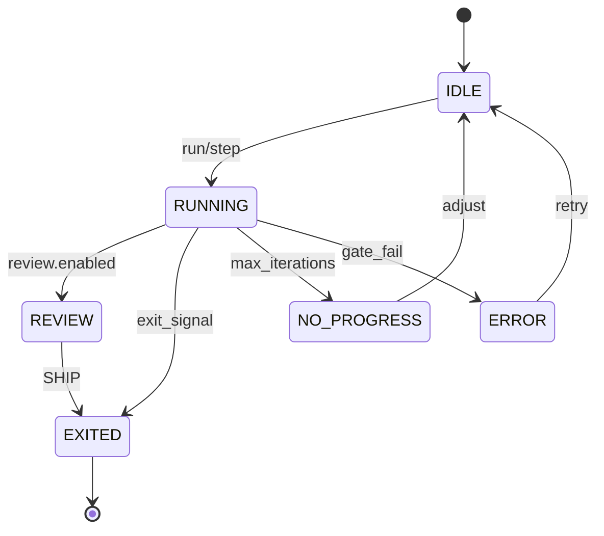

schema_version: 1
# Architecture Spec — Ralph Gold (PRD-derived)

## 1) Scope and assumptions

- Scope: CLI/devtools loop orchestration with deterministic iterations, receipts/context artifacts, review gate, watch mode, and optional TUI/interactive selection.  
- Assumption: primary user is a solo developer; simplicity and clarity drive design tradeoffs.  
- Assumption: VS Code bridge is optional and out-of-scope for MVP.  
Evidence: .spec/foundation-2026-01-23-ralph-gold-prd.md; docs/VSCODE_BRIDGE_PROTOCOL.md.

## 2) Architecture overview

Ralph Gold is a CLI-first loop controller that reads config + PRD tasks, executes deterministic iterations with gate checks, writes receipts/context artifacts, and exposes status via CLI/TUI, with optional watch mode for feedback and optional VS Code bridge integration.  
Evidence: README.md; docs/PROJECT_STRUCTURE.md; .spec/foundation-2026-01-23-ralph-gold-prd.md.

## 3) Component inventory (name, responsibility, boundaries)

- CLI Command Layer: parse commands and route to loop operations (init/run/step/status/tui/watch).  
- Config Loader: read/validate `.ralph/ralph.toml` and defaults.  
- PRD Tracker: read/write task state (`.ralph/PRD.md` or configured tracker).  
- Loop Engine: orchestrate iterations, enforce max iterations, exit rules.  
- Gate Runner: execute configured gates; collect results.  
- Review Gate: enforce required token (`SHIP`) when enabled.  
- Authorization Guard: enforce write permissions/paths for agent runs.  
- Receipts Writer: write command/evidence receipts to `.ralph/receipts/`.  
- Context Snapshotter: write `.ralph/context/<n>/ANCHOR.md` per iteration.  
- Status Reporter: produce CLI status outputs, JSON status.  
- Watch Mode Controller: file-change watcher that triggers gates.  
- TUI Controller: interactive loop control surface.  
- Interactive Selector: interactive task selection for `step/run`.  
- VS Code Bridge (optional): JSON-RPC interface for status/step.  
Evidence: docs/PROJECT_STRUCTURE.md; docs/COMMANDS.md; docs/VSCODE_BRIDGE_PROTOCOL.md; .spec/build-plan-2026-01-23-ralph-gold-prd.md.

## 4) Interfaces (internal/external)

- External CLI: `ralph init|run|step|status|tui|watch` with flags per docs.  
- External file interfaces: `.ralph/ralph.toml`, `.ralph/PRD.md`, `.ralph/state.json`, `.ralph/receipts/*`, `.ralph/context/*`.  
- Optional external API: VS Code bridge `status` and `step` JSON-RPC endpoints.  
- Internal interfaces: Loop Engine ↔ Gate Runner ↔ Receipts Writer ↔ Status Reporter; Config Loader ↔ Authorization Guard ↔ Writer components.  
- Test scenarios (TDD requirement): integration tests for CLI commands, receipts/context writing, review gate enforcement, authorization blocking.  
Evidence: docs/COMMANDS.md; docs/PROJECT_STRUCTURE.md; docs/VSCODE_BRIDGE_PROTOCOL.md; .spec/build-plan-2026-01-23-ralph-gold-prd.md.

## 5) Data flows (inputs, transforms, outputs)

- Input: CLI command + config + PRD tracker.  
- Transform: Loop Engine selects task, runs gates, determines exit state.  
- Output: receipts + context snapshots + status output + updated state/PRD files.  
- Optional: VS Code bridge reads status/step outputs.  
Evidence: README.md; docs/PROJECT_STRUCTURE.md; .spec/build-plan-2026-01-23-ralph-gold-prd.md.

## 6) Non-functional requirements

- Performance: `ralph status` median <= 500ms on repos <= 5k files; TUI refresh <= 2 Hz.  
- Reliability: >= 95% iterations complete without ERROR exit over 30 days.  
- Security/privacy: `.ralph/*` artifacts treated as sensitive; path-based authorization enforced.  
- Accessibility: no color-only cues; keyboard-only interaction.  
Evidence: .spec/ux-2026-01-23-ralph-gold-prd.md; .spec/build-plan-2026-01-23-ralph-gold-prd.md; docs/AUTHORIZATION.md.

## 7) Risks and mitigations

- Risk: UX confusion about exit state or progress.  
  Mitigation: status output includes exit reason and next-step guidance.  
- Risk: artifact growth slows loops or fills disk.  
  Mitigation: cleanup guidance and retention defaults.  
- Risk: unauthorized writes.  
  Mitigation: authorization guard restricts paths.  
Evidence: .spec/ux-2026-01-23-ralph-gold-prd.md; docs/PROJECT_STRUCTURE.md; docs/AUTHORIZATION.md.

## 8) Decisions / ADRs to create

- ADR: formal schemas for receipts/context/state (if enforcement needed).  
- ADR: retention policy ownership and enforcement (cleanup automation).  
- ADR: performance budget measurement harness.  
- ADR: watch mode auto-commit safety rules.  
Evidence: .spec/build-plan-2026-01-23-ralph-gold-prd.md.

## Diagrams

### System context
```mermaid
flowchart TD
  U[Solo Dev] --> CLI[CLI Commands]
  CLI --> LOOP[Loop Engine]
  LOOP --> GATES[Gate Runner]
  LOOP --> STATUS[Status Reporter]
  LOOP --> RECEIPTS[Receipts Writer]
  LOOP --> CONTEXT[Context Snapshotter]
  LOOP --> AUTH[Authorization Guard]
  STATUS --> OUT[Terminal Output]
  VS[VS Code Bridge (optional)] --> STATUS
```

### Key sequence (run iteration)
```mermaid
sequenceDiagram
  participant User
  participant CLI
  participant Loop
  participant Gates
  participant Receipts
  participant Status

  User->>CLI: ralph run
  CLI->>Loop: start iterations
  Loop->>Gates: run gates
  Gates-->>Loop: results
  Loop->>Receipts: write receipt
  Loop->>Status: update status
  Status-->>User: exit code + summary
```

### State model (loop run)

