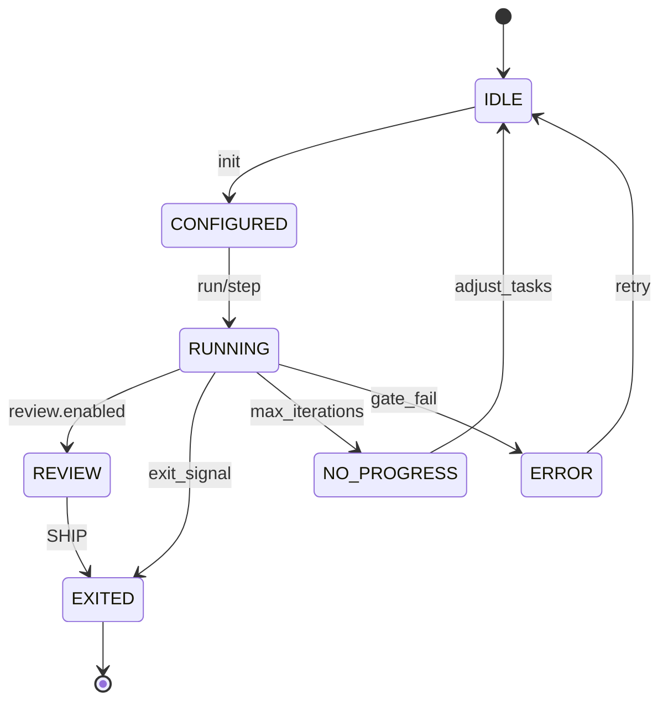

# UX Spec

> Use for `.spec/ux-2026-01-23-ralph-gold-prd.md`.  
> Every paragraph ends with `Evidence:` or `Evidence gap:`.

## 0) UX Summary

Ralph Gold should feel like a predictable, command-driven control loop where every iteration leaves traceable artifacts and the user always knows the current task state and exit conditions.  
Evidence: README.md (loop description, receipts, status/TUI).

## Pass 1: Mental Model

**Primary user intent:** run AI-assisted work in deterministic iterations with clear gates and exit signals to avoid drift and repeated work.  
Evidence: README.md (problem/solution, exit codes); user interview 2026-01-23.

**Likely misconceptions:**
- The loop will continue indefinitely without explicit exit signals or review gates.  
- Watch mode can be enabled without configuration.  
- Auto-commit is safe by default even with a dirty worktree.  
Evidence: README.md (exit codes, watch mode requires enable, auto-commit risk note).

**UX principle to reinforce/correct:** one task per iteration, explicit configuration, and always-available status visibility.  
Evidence: README.md (one task per iteration, status command, watch enablement).

**Evidence gate:** Pass 1 complete.  
Evidence: README.md.

## Pass 2: Information Architecture

**All user-visible concepts:**
- Loop, iteration, task, gates, review, receipts, context snapshots, configuration, status, TUI, watch mode, authorization rules, optional VS Code bridge integration.  
Evidence: README.md; docs/PROJECT_STRUCTURE.md; docs/CONFIGURATION.md; docs/AUTHORIZATION.md; docs/VSCODE_BRIDGE_PROTOCOL.md.

**Grouped structure:**

### Loop Control
- Loop: Primary (run/step/status)  
- Iteration: Primary  
- Task: Primary  
- Gates: Secondary  
- Review gate (SHIP): Secondary  
Evidence: README.md; docs/COMMANDS.md; docs/CONFIGURATION.md.

### Interaction Surfaces
- CLI commands: Primary  
- TUI: Secondary  
- Interactive task selector: Secondary  
Evidence: README.md; docs/COMMANDS.md; docs/interactive_selection.md.

### Artifacts & Evidence
- Receipts: Primary  
- Context snapshots: Primary  
- Logs/attempts: Secondary  
Evidence: README.md; docs/PROJECT_STRUCTURE.md; docs/EVIDENCE.md.

### Safety & Config
- ralph.toml configuration: Primary  
- Watch mode (opt-in): Secondary  
- Authorization rules: Secondary  
Evidence: docs/CONFIGURATION.md; docs/AUTHORIZATION.md.

### Optional Integrations
- VS Code bridge protocol: Secondary (out-of-scope for MVP).  
Evidence: docs/VSCODE_BRIDGE_PROTOCOL.md; user interview 2026-01-23 (MVP scope decision).

**Evidence gate:** Pass 2 complete.  
Evidence: README.md; docs/PROJECT_STRUCTURE.md.

## Pass 3: Affordances

| Action | Visual/Interaction Signal |
| --- | --- |
| Initialize repo | `ralph init` output + created `.ralph/` files |
| Run loop | `ralph run --agent <agent> --max-iterations N` |
| Run one iteration | `ralph step --agent <agent>` |
| Interactive task selection | `ralph step --interactive` UI list + key prompts |
| Show status | `ralph status` (optional `--detailed`/`--graph`) |
| Open control surface | `ralph tui` keybindings (s/r/a/p/q) |
| Enable watch mode | `[watch].enabled = true` then `ralph watch` |
| Require review gate | `[review].enabled = true` and `required_token = "SHIP"` |
Evidence: README.md; docs/COMMANDS.md; docs/CONFIGURATION.md; docs/interactive_selection.md.

**Affordance rules:**
- If a command appears in `ralph --help`, the user can run it without additional setup unless configuration explicitly requires enablement (e.g., watch mode).  
- If review gate is enabled, exit requires the configured token; status should signal when review is pending.  
Evidence: README.md; docs/CONFIGURATION.md.

**Evidence gate:** Pass 3 complete.  
Evidence: README.md.

## Pass 4: Cognitive Load

**Friction points:**
| Moment | Type | Simplification |
| --- | --- | --- |
| First-time setup | Uncertainty | Quickstart + `ralph init` scaffold |
| Long loops | Waiting | `ralph status` / TUI for visibility |
| Config options | Choice | Use defaults (loop mode, review disabled) |
| Watch mode enablement | Uncertainty | Explicit config requirement and help text |
Evidence: README.md; docs/CONFIGURATION.md.

**Defaults introduced:**
- Use `ralph step` for single iteration and `ralph status` for quick state checks.  
- Keep review gate and watch mode disabled by default unless enabled.  
Evidence: README.md; docs/CONFIGURATION.md.

**Evidence gate:** Pass 4 complete.  
Evidence: README.md.

## Pass 5: State Design

### Loop Execution (CLI/TUI)

| State | User Sees | User Understands | User Can Do |
| --- | --- | --- | --- |
| Empty | `ralph status` shows no iterations yet | Loop not started | Run `ralph step` or `ralph run` |
| Loading | Active iteration logs / TUI running state | Loop is executing | Wait or pause in TUI |
| Success | Exit code 0, status updated | Iteration completed | Run next iteration or inspect artifacts |
| Partial | Exit code 1 (no progress or max iterations) | Loop ended without full completion | Adjust tasks/config and re-run |
| Error | Exit code 2 or gate failure | Iteration failed | Inspect logs/receipts and retry |
Evidence: README.md (exit codes, status), docs/TROUBLESHOOTING.md.

### Watch Mode

| State | User Sees | User Understands | User Can Do |
| --- | --- | --- | --- |
| Disabled | `ralph watch` unavailable or warns | Watch not enabled | Set `watch.enabled = true` |
| Active | Watch output + gate results on change | Gates run on file changes | Edit files or stop with Ctrl+C |
| Error | Warning about config/patterns | Watch misconfigured | Fix config and restart |
| Stopped | Process exits | Watch stopped | Restart if needed |
Evidence: README.md (watch mode), docs/CONFIGURATION.md; docs/TROUBLESHOOTING.md.

**Evidence gate:** Pass 5 complete.  
Evidence: README.md.

## Pass 6: Flow Integrity

**Flow risks:**
| Risk | Where | Mitigation |
| --- | --- | --- |
| Circular dependencies stall progress | Task resolution loop | Show blocked tasks and fix dependencies |
| Missing watch enablement | Watch mode | Require config gate and show instructions |
| Large context snapshots slow runs | Iteration artifacts | Provide cleanup guidance |
Evidence: README.md (circular dependencies), docs/CONFIGURATION.md (watch), docs/PROJECT_STRUCTURE.md (artifact growth), docs/TROUBLESHOOTING.md.

**Visibility decisions:**
- Must be visible: current task status, loop exit reason, review pending state, gate failures.  
- Can be implied: artifact locations once initialized (documented in README).  
Evidence: README.md; docs/PROJECT_STRUCTURE.md.

**UX constraints:** CLI-first interaction with optional TUI; output must remain readable in terminal without rich UI.  
Evidence: README.md (CLI/TUI).

**Evidence gate:** Pass 6 complete.  
Evidence: README.md.

## State Machine Diagrams

Style rules:
- Single vertical spine for the main happy path.  
- Branch alternates to the sides.  
- Label every transition with trigger/guard.  
- Show timing hooks (e.g., periodic re-check).  
- Use uppercase state names; concise trigger labels; avoid crossing lines.  
Evidence: UX spec template.

Evidence: README.md (run/step/exit codes/review), docs/CONFIGURATION.md.

## Visual Specifications (only after Pass 6)

**Layouts / components / interaction specs:**
- CLI output uses short headings, status lines, and clear exit reason text.  
- TUI shows real-time status and keybindings (s/r/a/p/q).  
Evidence: README.md (TUI keybindings).

**Copy tone:**
- Plain, direct, and action-oriented; avoid jargon in error messages.  
- Always include the next suggested command when an error occurs.  
Evidence: user interview 2026-01-23 (tone decision).

**Accessibility baseline (terminal UX):**
- No color-only cues; include text labels for all statuses.  
- Maintain readable contrast for default terminal themes.  
- Keyboard-only navigation (no pointer requirements).  
Evidence: user interview 2026-01-23 (accessibility decision).

**Performance budgets:**  
- `ralph status` responds in <= 500ms on repos <= 5k files.  
- TUI refresh rate <= 2 Hz to avoid terminal flicker.  
- Watch debounce remains at 500ms default unless user changes.  
Evidence: README.md (watch debounce default); user interview 2026-01-23 (performance targets decision).

**Performance measurement method:**  
- Use `time ralph status` in a repo with <= 5k files and record median wall time over 10 runs.  
- Record TUI refresh intervals via timestamps in logs (if enabled).  
Evidence: user interview 2026-01-23 (measurement method decision).

**Hit-area rules:**
- CLI/TUI keybindings are single-character shortcuts; no pointer targets required.  
Evidence: README.md (TUI keybindings).

**Responsive breakpoints (tokenized):**
- Not applicable (terminal UI).  
Evidence: user interview 2026-01-23 (terminal UI decision).

**Token-based grid:**
- Not applicable (terminal UI).  
Evidence: user interview 2026-01-23 (terminal UI decision).

## UX Acceptance Criteria (Given/When/Then)

- Given a new repo, when I run `ralph init`, then `.ralph/` scaffolding exists and `ralph status` reports an empty state.  
  Evidence: README.md; docs/PROJECT_STRUCTURE.md.

- Given `review.enabled = true`, when a loop reaches exit conditions, then the loop does not exit until the required token is returned.  
  Evidence: README.md; docs/CONFIGURATION.md.

- Given watch mode is disabled, when I run `ralph watch`, then I receive a clear enablement instruction.  
  Evidence: README.md; docs/CONFIGURATION.md.

- Given a completed iteration, when I inspect `.ralph/receipts/` and `.ralph/context/`, then the latest receipt and ANCHOR files exist.  
  Evidence: README.md; docs/PROJECT_STRUCTURE.md.

- Given a gate failure, when I check `ralph status` or logs, then I can see the failure context and decide to retry.  
  Evidence: docs/TROUBLESHOOTING.md.

- Given CLI output, when a status is shown, then it includes a text label (not color-only) and a next-step suggestion on error.  
  Evidence: user interview 2026-01-23 (accessibility + copy decision).

- Given a repo with <= 5k files, when I run `ralph status`, then the command completes in <= 500ms median over 10 runs.  
  Evidence: user interview 2026-01-23 (performance decision).

## Evidence Gaps

- None for v1; decisions captured in interview with planned validation post-release.  
Evidence: user interview 2026-01-23.

## Evidence Map

| Claim/Section | Evidence | Notes |
| --- | --- | --- |
| UX Summary | README.md | Loop + auditability intent. |
| Mental Model | README.md | Problem/solution framing. |
| Information Architecture | README.md; docs/PROJECT_STRUCTURE.md; docs/CONFIGURATION.md; docs/AUTHORIZATION.md; docs/VSCODE_BRIDGE_PROTOCOL.md | Concepts and artifacts. |
| Affordances | README.md; docs/COMMANDS.md; docs/interactive_selection.md | Command surface. |
| Cognitive Load | README.md; docs/CONFIGURATION.md | Defaults and opt-in features. |
| State Design | README.md; docs/TROUBLESHOOTING.md | Exit codes and statuses. |
| Flow Integrity | README.md; docs/PROJECT_STRUCTURE.md; docs/TROUBLESHOOTING.md | Risks and mitigations. |
| State Machine | README.md; docs/CONFIGURATION.md | Review gate and exit signals. |
| Accessibility + Performance | README.md; user interview 2026-01-23 | Targets and accessibility baseline set by decision. |
