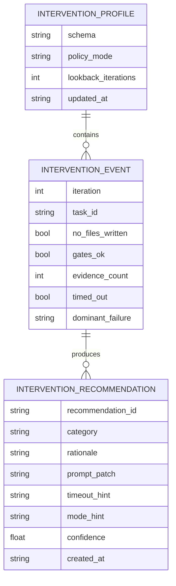

# ✨ feat: Add adaptive intervention recommendation engine

## Enhancement Summary

**Deepened on:** 2026-03-01  
**Sections enhanced:** 14 major sections + sub-sections  
**Research sources used:** local repository evidence, Context7 Python docs, web documentation (CLI, JSONL, OWASP GenAI)

### Key Improvements

1. Added a concrete **intervention contract** (recommend-only, confidence thresholds, deduping, and deterministic artifact schema/versioning).
2. Deepened CLI plan for `ralph interventions` with explicit **output contracts**, exit codes, and machine-readable behavior.
3. Expanded non-functional guarantees with **atomic-write/file-system caveats** (`os.replace` cross-filesystem behavior) and resilience fallbacks.
4. Added explicit **LLM/agent security considerations** (prompt injection, insecure output handling, excessive agency) and mitigations.
5. Strengthened test strategy with additional cross-layer integration scenarios and verification evidence rules.

### New Considerations Discovered

- `os.replace` is atomic only on successful same-filesystem operations; cross-filesystem replacements can fail and need fallback handling.
- JSONL conventions should be explicit for event logs (`UTF-8`, one JSON value per line, `\n` terminator).
- For CLI reliability, explicit stdout/stderr and `--json` behavior should be defined up front (not left implicit).

### Plan Changelog

| Date | Change | Notes |
|------|--------|-------|
| 2026-03-01 | Initial plan creation | Sub-agent discovery attempted; fallback to direct analysis |
| 2026-03-02 | Review fixes applied | Clarified v1 integration path, added backward-compatibility criteria, resolved research posture wording |

## Table of Contents

- [Enhancement Summary](#enhancement-summary)
- [Section Manifest](#section-manifest)
- [Overview](#overview)
- [Problem Statement](#problem-statement)
- [Research Decision](#research-decision)
- [Proposed Solution](#proposed-solution)
- [Technical Approach](#technical-approach)
  - [Architecture](#architecture)
  - [Data Model](#data-model)
  - [SpecFlow Coverage and Edge Cases](#specflow-coverage-and-edge-cases)
  - [Implementation Phases](#implementation-phases)
  - [Rollback Procedure](#rollback-procedure)
- [Alternative Approaches Considered](#alternative-approaches-considered)
- [System-Wide Impact](#system-wide-impact)
  - [Interaction Graph](#interaction-graph)
  - [Error & Failure Propagation](#error--failure-propagation)
  - [State Lifecycle Risks](#state-lifecycle-risks)
  - [API Surface Parity](#api-surface-parity)
  - [Integration Test Scenarios](#integration-test-scenarios)
- [Acceptance Criteria](#acceptance-criteria)
  - [Backward Compatibility Contract](#backward-compatibility-contract)
- [Success Metrics](#success-metrics)
- [Dependencies & Prerequisites](#dependencies--prerequisites)
- [Risk Analysis & Mitigation](#risk-analysis--mitigation)
- [Documentation Plan](#documentation-plan)
- [Implementation Notes (Pseudo Code)](#implementation-notes-pseudo-code)
- [Sources & References](#sources--references)
- [Future Considerations](#future-considerations)

## Section Manifest

Section 1: **Overview** — clarify scope boundaries and recommend-only invariants.  
Section 2: **Problem Statement** — sharpen pain points with observable system evidence.  
Section 3: **Proposed Solution** — enrich with policy constraints and recommendation lifecycle.  
Section 4: **Architecture** — add module contracts, interfaces, and non-blocking failure posture.  
Section 5: **Data Model** — add schema consistency rules and JSONL conventions.  
Section 6: **Implementation Phases** — tighten sequencing, verification gates, and rollout safety.  
Section 7: **System-Wide Impact** — deepen error propagation and state consistency details.  
Section 8: **Acceptance Criteria** — make operational and measurable criteria more explicit.  
Section 9: **Success Metrics** — define baselines, trend windows, and adoption indicators.  
Section 10: **Risk/Security** — include prompt-injection and excessive-agency mitigations.  

## Overview

Add a **recommend-only Adaptive Intervention Engine** that converts failed loop iterations into structured, versioned guidance for the next iteration (see brainstorm: `docs/brainstorms/2026-03-01-adaptive-intervention-engine-brainstorm.md`).

This feature will synthesize existing Ralph signals (`no_files_written` receipts, gate outcomes, evidence count, attempt history, harness trends) into targeted recommendations for prompt constraints and timeout/mode hints. Recommendations are persisted and surfaced to operators, but **not auto-applied** in v1.

### Research Insights

**Best Practices:**

- Keep v1 in explicit **advisory mode** to avoid implicit behavior drift (aligned with brainstorm decision).
- Define a stable recommendation payload early so operator tooling and future automation can safely build on it.

**Implementation Detail:**

- Treat recommendation generation like evidence extraction: useful but non-blocking to core loop completion.

## Problem Statement

Ralph already captures rich diagnostics but currently leaves synthesis to manual operator interpretation:

- No-files detection and remediation are generated ad hoc per iteration (`/Users/jamiecraik/dev/ralph-gold/src/ralph_gold/loop.py:1900-1925`, `2710-2885`).
- Feedback is manually authored in `.ralph/FEEDBACK.md` and then injected into prompt context (`/Users/jamiecraik/dev/ralph-gold/src/ralph_gold/loop.py:460-471`, `583-586`).
- Evidence and harness metrics are collected but not converted into an explicit adaptation policy (`/Users/jamiecraik/dev/ralph-gold/src/ralph_gold/loop.py:2352-2374`, `/Users/jamiecraik/dev/ralph-gold/src/ralph_gold/harness.py:99-127`, `362-463`).

Result: repeated failure patterns can recur without a deterministic, first-class policy recommendation artifact.

### Research Insights

**Common Pitfall:**

- Systems that collect operational telemetry but do not produce explicit, user-visible policy guidance tend to rely on ad hoc operator memory and degrade under long-running workloads.

**Quality Opportunity:**

- Promote high-signal failure patterns to first-class artifacts (`.ralph/interventions/*`) to make behavior reviewable and reproducible.

## Research Decision

**Research posture:** Initial planning relied on local repository evidence; targeted external references added during deepening pass (see External References section for CLI, JSONL, Python semantics, OWASP GenAI).

**Rationale:** This feature is internal orchestration behavior with strong local context and existing patterns for receipts, metrics, harness, feedback, and timeout adaptation. No payment/security/external API surface expansion is introduced.

Local findings used:

- Existing adaptive timeout foundation (`/Users/jamiecraik/dev/ralph-gold/src/ralph_gold/config.py:550-573`, `/Users/jamiecraik/dev/ralph-gold/src/ralph_gold/loop.py:1779-1798`).
- Existing state model with attempts/blocked tracking (`/Users/jamiecraik/dev/ralph-gold/src/ralph_gold/loop.py:623-659`, `2328-2333`).
- Existing feedback loop documentation (`/Users/jamiecraik/dev/ralph-gold/docs/FEEDBACK_LOOPS.md:22-43`).
- Institutional learnings directory not present (`docs/solutions/` missing).

### Research Insights

**Research posture clarification:**

- Initial planning used local-first discovery; deepening pass added targeted external references for CLI conventions, JSONL format, Python file-atomicity semantics, and OWASP GenAI security framing.

## Proposed Solution

Implement a new recommendation pipeline that runs after each iteration and writes deterministic policy advice under `.ralph/interventions/`.

Core behavior in v1:

1. Aggregate recent signals (rolling 20–30 iterations + harness trend summaries) (see brainstorm).
2. Classify dominant failure mode(s): no-files, repeated gate failure, timeout churn, low-evidence completion.
3. Produce a structured recommendation bundle (reason, confidence, suggested prompt constraints, suggested timeout/mode hints).
4. Persist recommendation artifacts and append concise operator-visible summary.
5. Feed recommendation text into existing prompt memory path via `.ralph/FEEDBACK.md` append (v1 canonical path; alternatives deferred to Future Considerations).
6. Require operator acknowledgement/opt-in for any policy change; no automatic runner/gate mutation in v1 (see brainstorm).

### Research Insights

**Best Practices:**

- Add recommendation **deduping** per `(task_id, category)` within configurable window to reduce noise.
- Enforce confidence threshold bands (e.g., low/medium/high) so weak signals do not create over-prescriptive recommendations.

**Operational Rule:**

- Keep recommendations advisory and annotate with exact source evidence pointers (`history iteration`, `receipt path`, `harness metric`).

## Technical Approach

### Architecture

Add an intervention module with pure functions and deterministic I/O boundaries:

- `src/ralph_gold/interventions.py`
  - signal extraction from recent state + receipts + harness metrics
  - recommendation scoring/selection
  - artifact serialization
- `src/ralph_gold/loop.py`
  - invoke recommendation synthesis after iteration result finalization
  - write intervention artifact paths into history metadata
- `src/ralph_gold/config.py`
  - new `InterventionConfig` with safe defaults and explicit recommend-only mode
- `src/ralph_gold/cli.py`
  - `ralph interventions` read/report command (summary + latest recommendation)

### Research Insights

**Architecture Patterns:**

- Keep an explicit execution contract:
  - Input: normalized iteration window + optional harness summary.
  - Output: single canonical recommendation object + optional diagnostics bundle.
- Separate **signal collection** from **policy inference** to improve testability and future replacement.

**CLI Surface Suggestions (`ralph interventions`):**

- `ralph interventions` → concise summary (human-readable).
- `ralph interventions --json` → stable schema output.
- `ralph interventions --window 30` → override lookback for diagnostics.
- `ralph interventions --latest` → show latest recommendation only.

**Output Semantics:**

- Primary machine output to stdout, operator diagnostics/errors to stderr (CLI guideline pattern).
- Keep exit code semantics explicit: success=0; usage/validation errors=2.

### Data Model



Planned artifacts:

- `.ralph/interventions/profile.json`
- `.ralph/interventions/events.jsonl`
- `.ralph/interventions/latest-recommendation.json`
- `.ralph/interventions/README.md` (operator-facing interpretation rules)

### Research Insights

**JSONL Conventions (for `events.jsonl`):**

- UTF-8 encoded.
- Exactly one JSON value per line.
- Newline separator `\n` (with `\r\n` tolerated on read).
- Recommend trailing newline for append safety.

**Data Integrity:**

- Use schema version field in every artifact.
- Add `source_window: {from_iteration,to_iteration}` and `source_evidence_paths[]` for traceability.

### SpecFlow Coverage and Edge Cases

SpecFlow analyzer agent was unavailable in this environment; manual flow analysis applied.

Primary flows:

1. **Failure observed → recommendation generated**
2. **Recommendation persisted → visible in next iteration context**
3. **Operator accepts recommendation → subsequent run quality improves**

Edge cases to cover:

- Missing/corrupt receipts (engine must degrade gracefully to available signals).
- Sparse history (< lookback window) should produce low-confidence recommendations.
- Contradictory signals (e.g., high evidence count + no files receipt) must produce a single prioritized outcome with rationale.
- Tracker kind parity (`markdown|yaml|github_issues|web_analysis|beads`) must not break recommendation generation.
- JSON output mode compatibility: recommendation logs must not pollute machine-readable command output.

### Research Insights

**Additional Edge Cases:**

- Cross-filesystem artifact moves/replacements must not assume atomic rename success.
- Recommendation recursion guard: a recommendation should not repeatedly re-trigger itself without fresh evidence.
- Ensure behavior when `.ralph/interventions/` is missing or non-writable: warn and continue.

### Implementation Phases

#### Phase 1: Foundation (config + models)

- [ ] `src/ralph_gold/config.py`: add `InterventionConfig` with recommend-only default.
- [ ] `src/ralph_gold/interventions.py`: add dataclasses + schema constants + serializer.
- [ ] `tests/test_interventions.py`: unit tests for config parsing and model validation.

#### Phase 2: Signal synthesis + recommendation engine

- [ ] `src/ralph_gold/interventions.py`: implement signal extraction from state/receipts/harness.
- [ ] `src/ralph_gold/loop.py`: call intervention synthesis after iteration finalization.
- [ ] `tests/test_loop_progress.py` and new `tests/test_interventions_integration.py`: verify recommendation emission without behavior regressions.

#### Phase 3: Operator surfaces + docs

- [ ] `src/ralph_gold/cli.py`: add `ralph interventions` summary/report subcommand.
- [ ] `docs/COMMANDS.md`: document intervention command + output examples.
- [ ] `docs/FEEDBACK_LOOPS.md`: add recommend-only adaptation workflow.
- [ ] `README.md`: add high-level feature description and safety boundaries.

### Research Insights

**Sequencing Additions:**

- Add a phase gate between 2 and 3: run a controlled replay on recent state snapshots to check recommendation stability.
- Add explicit `--json` schema tests for `ralph interventions` command in Phase 3.

**Verification Commands (planned):**

- `uv run pytest -q tests/test_interventions.py tests/test_interventions_integration.py`
- `uv run pytest -q`

### Rollback Procedure

If recommendation quality regresses or intervention artifacts cause issues:

1. **Disable intervention generation:**
   ```bash
   # Set in .ralph/config.yaml or env
   interventions.enabled: false
   ```

2. **Ignore existing artifacts:**
   - Intervention artifacts are read-only by the core loop in v1; no mutation of state/tracker data.
   - Remove `.ralph/interventions/` directory to clear all recommendations if desired.

3. **Restore baseline metrics window:**
   - Use existing state snapshots to compare pre/post intervention behavior.
   - Re-run with `interventions.enabled: false` to establish clean baseline.

4. **Recovery verification:**
   ```bash
   uv run pytest -q  # ensure core loop still passes
   ralph interventions  # should report "disabled" or "no data"
   ```

## Alternative Approaches Considered

- **A) Recommend-only coach (selected)**: chosen for lowest risk and highest auditability (see brainstorm).
- **B) Auto-apply low-risk interventions**: deferred; requires proven recommendation quality and rollback semantics.
- **C) Autonomous policy controller**: deferred; too much scope/complexity for v1.

### Research Insights

- The selected approach best aligns with OWASP GenAI risks around excessive agency and insecure output handling by keeping humans in the loop for policy application.

## System-Wide Impact

### Interaction Graph

Action: `ralph run|step` iteration completes in loop.

1. `run_iteration` writes runner/gate/evidence/no-files receipts.
2. Intervention engine reads latest state + receipts + optional harness snapshots.
3. Engine writes intervention artifacts under `.ralph/interventions/`.
4. Next `build_prompt` includes recommendation context through feedback memory path.

### Research Insights

- Add explicit “do-not-mutate-core” boundary: intervention path can read core artifacts and write intervention artifacts, but cannot alter task tracker state in v1.

### Error & Failure Propagation

- Intervention failures must be **non-blocking** for core loop completion (same posture as evidence extraction).
- Parsing errors in intervention artifacts should log debug/warn and skip recommendation usage for that run.
- CLI reporting command should return non-zero only when explicitly requested strict mode is enabled.

### Research Insights

- Surface parser/artifact corruption as machine-readable warning objects in `--json` output to support automation triage.

### State Lifecycle Risks

- Partial-write risk for intervention artifacts mitigated with atomic JSON writes where applicable.
- Recommendation history growth risk mitigated by retention cap (count- or days-based).
- Avoid stale policy reuse by storing schema + generation timestamp + source iteration window.

### Research Insights

- `os.replace()` atomicity guarantees apply only on successful same-filesystem replacements; implement fallback and explicit error paths for cross-filesystem failures.

### API Surface Parity

Surfaces requiring parity:

- CLI text output vs JSON output modes (`ralph interventions` must support both).
- Existing loop modes (`speed|quality|exploration`) should accept recommendations as hints, not forced overrides.
- Existing trackers should remain behaviorally equivalent.

### Research Insights

- Include `--plain`-style stable output (or documented equivalent) for script consumers that do not want rich text.

### Integration Test Scenarios

1. Iteration produces `no_files_written` receipt; recommendation category becomes `no_files_reinforcement` and persists.
2. Repeated timeout attempts for same task increase timeout hint confidence while keeping recommend-only behavior.
3. Corrupt/missing receipt files do not fail loop; recommendation downgraded with explicit rationale.
4. Harness data present vs absent yields deterministic fallback behavior.
5. JSON output mode remains machine-readable when intervention summaries are enabled.

### Research Insights

Additional scenarios:

6. `events.jsonl` append remains valid after restart/crash-recovery sequence.
7. Recommendation deduping prevents duplicate outputs for unchanged failure windows.
8. Cross-filesystem write path gracefully degrades without losing prior artifacts.

## Acceptance Criteria

### Functional Requirements

- [ ] Engine writes a recommendation artifact after iterations with sufficient failure signal.
- [ ] Recommendation payload includes category, rationale, confidence, and suggested prompt/timeout/mode hints.
- [ ] Recommendations can be surfaced to operator via CLI report command.
- [ ] No runtime policy is auto-applied in v1 (recommend-only invariant).

### Non-Functional Requirements

- [ ] Loop runtime overhead for intervention synthesis remains bounded (target <150ms median per iteration over local benchmark set).
- [ ] Artifact writes are deterministic and schema-versioned.
- [ ] Feature preserves existing exit/gate semantics (no regression in loop completion rules).

### Quality Gates

- [ ] New unit/integration tests for intervention logic and loop integration.
- [ ] Existing `uv run pytest -q` suite passes.
- [ ] Documentation updated with TOC-consistent sections where modified.

### Backward Compatibility Contract

- [ ] **State file compatibility:** Old `.ralph/state.json` files (without intervention metadata) must load without error; unknown fields must be ignored safely.
- [ ] **History schema resilience:** Adding `intervention_artifact_path` to history entries must not break existing status/harness tooling that reads history.
- [ ] **Receipt compatibility:** Existing receipt formats must remain parseable; intervention engine must degrade gracefully when expected receipt fields are missing.
- [ ] **Test coverage:** Add regression test loading a pre-intervention state snapshot and verifying loop continues without intervention-related errors.

### Research Insights

- Add explicit criterion for CLI output contract:
  - [ ] `ralph interventions --json` validates against documented schema and emits no human-only formatting artifacts.
- Add explicit criterion for security hygiene:
  - [ ] Recommendation artifacts must not include secrets, token-like strings, or raw sensitive payload excerpts.

## Success Metrics

Primary (from brainstorm):

- Rolling 20–30 iteration reduction in combined:
  - `no_files_written` rate
  - auto-blocked task rate

Secondary:

- Recommendation adoption rate (operator accepted/applied recommendations).
- Median attempts-to-completion for tasks touched after recommendation generation.

### Research Insights

- Capture baseline snapshot before rollout and compare same-length windows post-rollout.
- Track false-positive recommendation rate (operator rejects recommendation due low relevance).

## Dependencies & Prerequisites

- Existing `.ralph/state.json` history format.
- Existing receipts pipeline (`runner.json`, `gate_*.json`, `no_files_written.json`, `evidence.json`).
- Harness artifacts when available (optional, not required).

### Research Insights

- Ensure intervention module tolerates absence of harness artifacts by design (soft dependency).

## Risk Analysis & Mitigation

- **Risk:** recommendation spam/noise.  
  **Mitigation:** confidence threshold + dedup window per task/category.
- **Risk:** overfitting to recent anomalies.  
  **Mitigation:** blended lookback (recent 20–30 + harness trend aggregation).
- **Risk:** operator trust erosion.  
  **Mitigation:** always provide rationale + source evidence pointers; keep recommend-only in v1.

### Research Insights

- **Risk:** prompt injection contamination into recommendation text from untrusted model output.  
  **Mitigation:** sanitize/escape recommendation excerpts; store structured signals separate from free-form model text.
- **Risk:** insecure output handling by downstream automation consuming recommendations.  
  **Mitigation:** schema-validate and bound recommendation fields before emission.
- **Risk:** excessive agency drift in future phases.  
  **Mitigation:** preserve explicit policy-mode switch with recommend-only default and auditable opt-in to auto-apply.

## Documentation Plan

- Update `/Users/jamiecraik/dev/ralph-gold/README.md` with feature summary and boundaries.
- Update `/Users/jamiecraik/dev/ralph-gold/docs/COMMANDS.md` with new command usage.
- Update `/Users/jamiecraik/dev/ralph-gold/docs/FEEDBACK_LOOPS.md` with intervention workflow.
- Add `/Users/jamiecraik/dev/ralph-gold/docs/EVIDENCE.md` section on intervention evidence lineage if needed.

### Research Insights

- Include one operator playbook example: “recommendation generated → operator review → accepted change recorded.”
- Include one script-friendly JSON example for `ralph interventions --json`.

## Implementation Notes (Pseudo Code)

### `src/ralph_gold/interventions.py`

```python
# src/ralph_gold/interventions.py

def build_recommendation_window(state_history, receipts_index, harness_summary, lookback=30):
    """Collect normalized failure signals for recommendation synthesis."""
    ...


def synthesize_recommendation(window):
    """Return best recommendation with rationale and confidence."""
    ...
```

### `src/ralph_gold/loop.py`

```python
# src/ralph_gold/loop.py

def run_iteration(...):
    ...
    # after receipts + metrics finalized
    recommendation = synthesize_recommendation(...)
    write_intervention_artifacts(recommendation)
```

### Research Insights

- Add guard rails in pseudo-flow:
  - if signal quality < threshold: write low-confidence “observe-only” recommendation.
  - if artifact write fails: log warning and continue without affecting exit/gate outcome.

## Sources & References

### Origin

- **Brainstorm document:** [`docs/brainstorms/2026-03-01-adaptive-intervention-engine-brainstorm.md`](../brainstorms/2026-03-01-adaptive-intervention-engine-brainstorm.md)
  - Carried-forward decisions: recommend-only v1, 20–30 iteration lookback, success metric focused on no-files + blocked-rate reduction, prompt+timeout hint surface (see brainstorm).

### Internal References

- Prompt feedback ingestion: `/Users/jamiecraik/dev/ralph-gold/src/ralph_gold/loop.py:443-600`
- Adaptive timeout integration: `/Users/jamiecraik/dev/ralph-gold/src/ralph_gold/loop.py:1779-1798`
- No-files detection/remediation: `/Users/jamiecraik/dev/ralph-gold/src/ralph_gold/loop.py:1900-1925`, `2710-2885`
- Evidence extraction and receipt writing: `/Users/jamiecraik/dev/ralph-gold/src/ralph_gold/loop.py:2352-2374`, `/Users/jamiecraik/dev/ralph-gold/src/ralph_gold/evidence.py:100-248`
- Harness signal extraction: `/Users/jamiecraik/dev/ralph-gold/src/ralph_gold/harness.py:99-127`, `362-463`
- Existing feedback-loop operator process: `/Users/jamiecraik/dev/ralph-gold/docs/FEEDBACK_LOOPS.md:22-43`
- Prior design exploration (not implemented): `/Users/jamiecraik/dev/ralph-gold/.spec/backend-design-agent-effectiveness-improvements.md:115-242`

### External References

- Python `argparse` documentation: <https://docs.python.org/3.12/library/argparse.html>
- Python `os.replace` semantics: <https://docs.python.org/3/library/os.html>
- Python logging cookbook patterns: <https://docs.python.org/3.15/howto/logging-cookbook>
- CLI Guidelines (clig.dev): <https://clig.dev/>
- JSON Lines format reference: <https://jsonlines.org/>
- OWASP Top 10 for LLM/GenAI Applications: <https://owasp.org/www-project-top-10-for-large-language-model-applications/>
- OWASP GenAI project (2025 onward updates): <https://genai.owasp.org/llm-top-10/>

### Conventions

- Planning and workflow guardrails: `/Users/jamiecraik/dev/ralph-gold/AGENTS.md`
- Global tooling and execution conventions: `/Users/jamiecraik/.codex/AGENTS.md`, `/Users/jamiecraik/.codex/instructions/tooling.md`

## Future Considerations

The following items are explicitly deferred from v1 scope:

- **Alternative prompt-context paths:** Instead of appending to `.ralph/FEEDBACK.md`, future versions may support a dedicated `.ralph/interventions/context.md` included by the prompt builder, or direct injection into the prompt template without operator-editable files.
- **Auto-apply low-risk interventions:** Requires proven recommendation quality, explicit opt-in, and full rollback semantics.
- **Autonomous policy controller:** Too much scope/complexity for v1; consider only after recommendation stability is validated.
